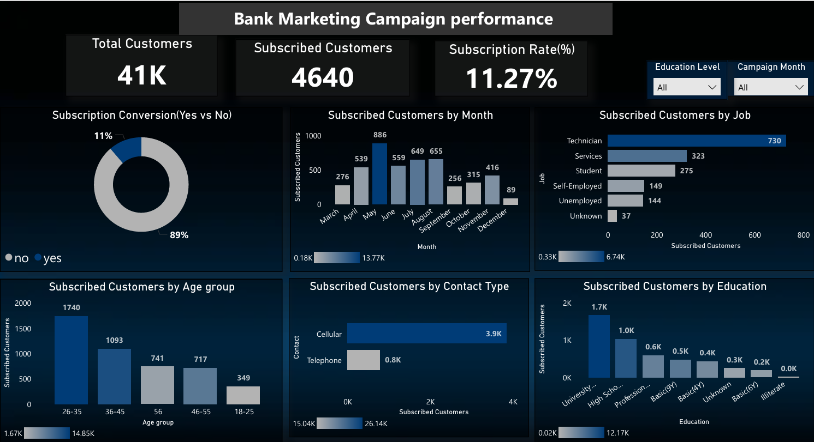

# Bank Marketing Campaign Analysis – Power BI

## Project Overview
This project analyzes a bank marketing campaign to understand customer subscription behavior and evaluate campaign performance using interactive Power BI dashboards.

## Tools Used
- Power BI
- DAX
- Excel / CSV Dataset

## Key Insights
- Total Customers: 41,000+
- Subscribed Customers: 4,640
- Subscription Rate: 11.27%
- Highest subscriptions occurred in May and June
- Technicians and Service job roles showed higher subscription rates
- Customers aged 26–35 subscribed the most
- Cellular contact type performed better than telephone

## Dashboard Features
- KPI cards for key performance metrics
- Month-wise subscription trend with custom month sorting
- Analysis by job, age group, education, and contact type
- Interactive slicers for Education and Month

## Dashboard Preview

## Files
- Power BI Dashboard (.pbix)
- Dashboard Screenshot (PNG)
